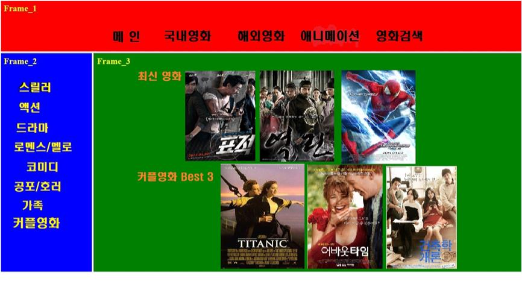
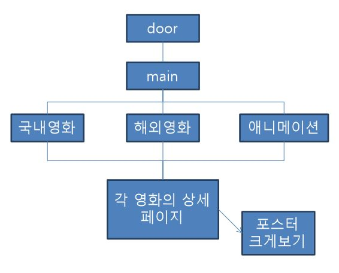
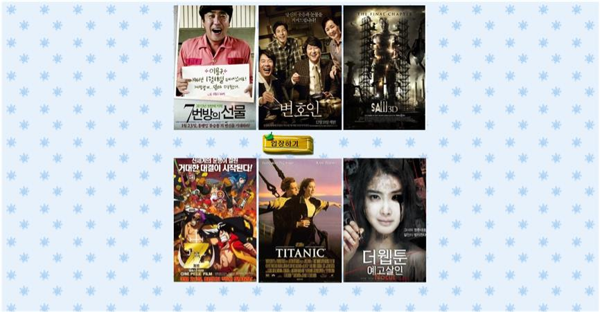

# HTML-MovieBox

## 개요

-   영화 정보를 보여주는 웹 사이트

## 제작과정

-   프로젝트 명 : Movie Box
-   수행기간 : 2014년 5월
-   프로젝트 인원 : 1명
-   나의 기여도 : 100%
-   담당 :
    -   영화정보 수집
        -   포스터, 줄거리, 평점 등
    -   프로젝트 폴더 구조 계획
    -   Project Directory Architecture 계획
    -   개발

## 주요 기술

-   HTML, CSS, JavsScript
-   frame을 이용한 header, Content 나누기
-   marquee 태그
-   드롭다운 메뉴
-   window object를 이용한 포스터 확대보기 구현

## 개발 환경

-   **OS** : Windows 7
-   **IDE** : Notepad++
-   **Browser** : Chrome

## 세부내용

### 초기 기획안



> 초기 기획안은 Header, SideMenu, Content로 세개의 frame으로 나누는 것이었지만  
> Header 메뉴를 드롭다운으로 구현하는 것으로 방식을 변경하였다.

### 웹 사이트 구조



### 전체 Process


### 주요 기능

-   **Door 화면**

    

    > table을 이용하여 구현하였다.

-   **Main**

    

    `project/frame_contents/home_contents.htm`

    ```html
    <marquee behavior="alternate" width="1000">
        <table>
            ...
        </table>
    </marquee>
    ```

    > marquee 태그를 이용하여 좌우로 움직이도록 만들었다.

-   **Menu Mouse over**

    

    > css로 드롭다운 메뉴 구현  
    > code : `Project/frame_menu/menu.htm`

-   **view poster big size**

    

    `project/movie/표적.htm`

    ```html
    <script language="javascript" src="movie.js"></script>
    ... 
    
    ```

    `project/movie/국내/movie.js`

    ```javascript
    function openWin(src) {
        win = window.open('' + src + '', 'win', 'width=1024 height=768 directories=no');
        win.document.write('<html><head>');
        win.document.write('<title>포스터 확대보기</title>');
        win.document.write("</head><body leftmargin=0 topmargin=0 onclick='self.close()'>");
        win.document.write("");
        win.document.write('</body></html>');
    }
    ```

    > 영화 상세 페이지에서 포스터 클릭 시 팝업창으로 포스터를 크게 볼 수 있다.
